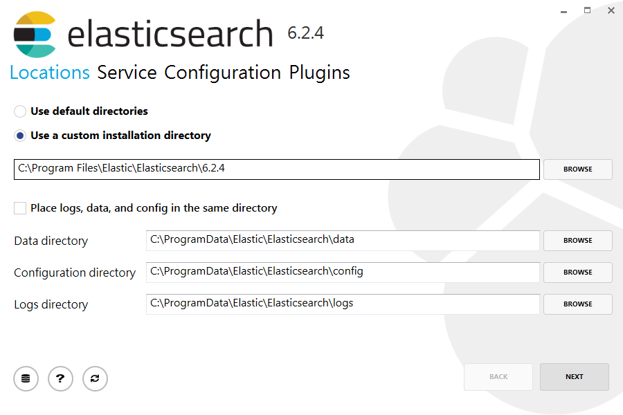
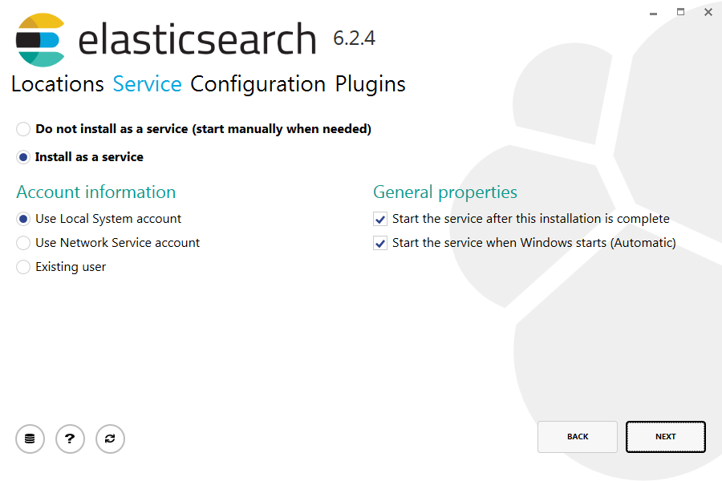
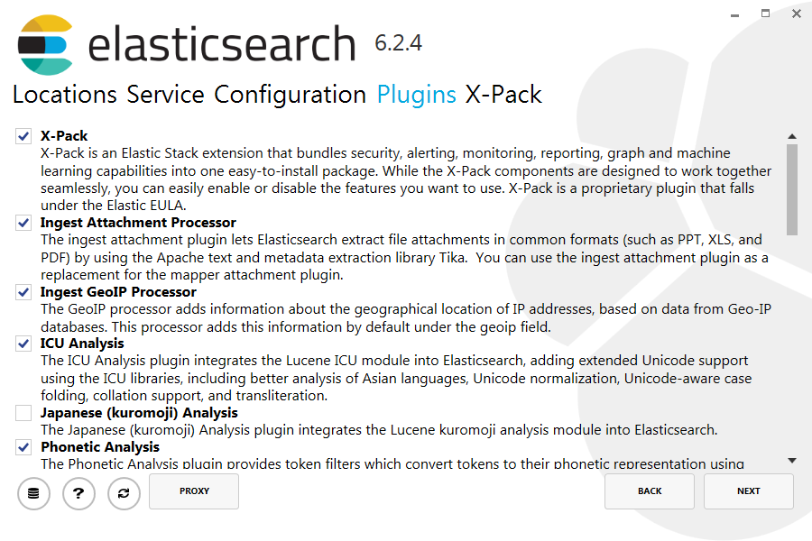

# 系統架構

# 系統應用

[阿里云 · Elasticsearch](https://data.aliyun.com/product/elasticsearch?utm_content=se_1309736&gclid=Cj0KCQjw_ODWBRCTARIsAE2_EvWXzaSpLpM_EsKh8t-LvGNOoN6WQRHOpyFFCM0k01K4TzF4JXo7GT0aAo8YEALw_wcB)

# 本次實測環境
```
特別留意軟體版本之差異
安裝elasticsearch前須先安裝Java
目前支援版本:Java 8(特別測試版本相容度)
```
本次環境安裝分成兩部分:
>* 安裝elasticsearch伺服器+Kibana
>* 安裝客戶端資料傳送軟體


### 安裝 Java 8
```
 Java SE Development Kit 8u171
 http://www.oracle.com/technetwork/java/javase/downloads/jdk8-downloads-2133151.html
http://www.oracle.com/technetwork/java/javase/downloads/jdk8-downloads-2133151.html

執行 echo %Path%指令來看看目前的 Path 變數設定

第一次安裝 JDK,並且從未修改過 Path 變數,則可以發現 Path 變數中並沒有包括 JDK 目錄下的 bin 資料夾,
也就是 JDK 工具程式所在的資料夾,所以當您下javac 指令時,作業系統不知道該至 bin 目錄下找 javac 工具程式。

確認執行檔目錄:
C:\Program Files\Java\jdk1.8.0_171\bin

PATH = C:\Program Files\Java\jdk1.8.0_171\bin;%PATH%
```

# 安裝伺服器系統

### 安裝elastic search(使用msi)





### 安裝elastic search

```
[1]下載Download and unzip Elasticsearch

https://www.elastic.co/guide/en/elasticsearch/reference/current/windows.html
https://www.elastic.co/downloads

elasticsearch-6.2.2.zip

[2]解壓縮
將elasticsearch-6.2.2.zip解壓縮後改名為elasticsearch
放置D:\elasticsearch

[3]修改設定檔
修改 D:\elasticsearch\config\elasticsearch.yml
------------------------------
network.host: 0.0.0.0
------------------------------

[4]修改 bat檔 
Run bin/elasticsearch (or bin\elasticsearch.bat on Windows)

Run curl http://localhost:9200/ or Invoke-RestMethod http://localhost:9200 with PowerShell

D:\elasticsearch\bin\elasticsearch.bat

http://127.0.0.1:9200/

```
### 安裝 kibana

```
[1]下載

[2]解壓縮
將kibana-6.2.2-windows-x86_64.zip解壓縮後改名為kibana
放置D:\kibana

[3]修改設定檔
D:\kibana\config\kibana.yml
---------------------------------------
server.host: "0.0.0.0"
---------------------------------------
[4]修改 bat檔
C:\Program Files\kibana\bin\kibana.bat


http://127.0.0.1:5601/
```
# 安裝客戶端資料傳送軟體

### 安裝 winlogbeat@Windows

```
[1]下載
[2]解壓縮
將winlogbeat-6.2.2-windows-x86.zip解壓縮後改名為winlogbeat
放置D:\winlogbeat

[3]使用powershell安裝

Set-ExecutionPolicy RemoteSigned

cd 'C:\Program Files\Winlogbeat'
.\install-service-winlogbeat.ps1

[4]修改設定檔
D:\winlogbeat\winlogbeat.yml
修改如下:
---------------------------------------
winlogbeat.event_logs:
  - name: Application
  - name: Security
  - name: System

output.elasticsearch:
  hosts:
    - localhost:9200

setup.kibana:
  host: "localhost:5601"
  
logging.to_files: true
logging.files:
  path: C:/ProgramData/winlogbeat/Logs
logging.level: info
---------------------------------------

[5]測試
.\winlogbeat.exe test config -c .\winlogbeat.yml -e


.\winlogbeat setup --template -E output.logstash.enabled=false -E 'output.elasticsearch.hosts=["localhost:9200"]'


http://localhost:9200/winlogbeat-*


.\winlogbeat setup --dashboards

[]使用powershell啟動winlogbeat服務

Start-Service winlogbeat
```
### 安裝 logstash@Ubuntu MATE (64-bit)

```
sudo apt-get install openjdk-8-jre
sudo apt-get install grok
curl -L -O https://artifacts.elastic.co/downloads/logstash/logstash-5.2.0.zip
unzip logstash-5.2.0.zip
sudo mv logstash-5.2.0/ /opt
cd /opt 
sudo mv logstash-5.2.0/ logstash
```
```
sudo apt-get install ant texinfo openjdk-8-jdk build-essential
git clone https://github.com/jnr/jffi.git
cd jffi
ant jar
sudo cp build/jni/libjffi-1.2.so /opt/logstash/vendor/jruby/lib/jni/arm-Linux

sudo vim config/jvm.options
----------------------------------
-Xms512m
-Xmx512m
----------------------------------


cd /opt/logstash
sudo vim apache-filter.conf 

設定檔
----------------------------------
input {
  file {
    path => "/var/log/apache2/access.log"
    start_position => "beginning"
  }
}

filter {
  if [path] =~ "access" {
    mutate { replace => { "type" => "apache_access" } }
    grok {
      match => { "message" => "%{COMBINEDAPACHELOG}" }
    }
  }
  date {
    match => [ "timestamp" , "dd/MMM/yyyy:HH:mm:ss Z" ]
  }
}

output {
  elasticsearch {
    hosts => ["192.168.2.62:9200"]
  }
  stdout { codec => rubydebug }
}
----------------------------------

sudo bin/logstash -f apache-filter.conf


http://192.168.2.62:9200/_search?q=DVWA


http://127.0.0.1:5601/
```
